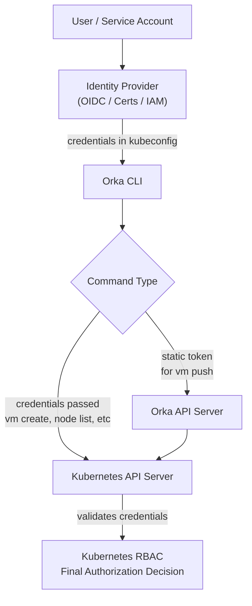

Orka does not have a separate authentication system. It relies entirely on Kubernetes authentication and authorization. When you use the `orka3` CLI, it communicates with the Kubernetes API server the same way `kubectl` does. If your `kubectl` configuration works, `orka3` works too.

For most commands, the CLI passes your credentials (a static token, client certificate, or an exec-based plugin token) to the Kubernetes API server. The API server validates those credentials against its configured authentication methods, then applies RBAC rules to determine what the user can do.

For some operations like `vm push`, the CLI sends the token to the Orka API server instead, because VM uploads require permissions to manage Kubernetes jobs that Orka users do not have directly.



<Note>
For API and CI/CD integrations, use a dedicated service account with a long-lived token rather than a user token. User tokens expire (default: 1 hour) and are not suitable for automation.
</Note>

## Default RBAC resources

Orka automatically creates a set of ClusterRoles and RoleBindings in every deployment, regardless of which identity provider is used. These resources control access to Orka functionality, not to the broader Kubernetes cluster.

### Roles

| Role | Scope | Purpose |
|---|---|---|
| `orka-admin` | Namespaced | Full Orka administrative permissions for managing Orka resources, nodes, and `orka-registry` secrets in `orka-*` namespaces |
| `orka-dev` | Namespaced | Developer permissions for managing Orka resources within a namespace |
| `orka-namespace-admin` | Cluster-wide | Permissions to create, list, and delete namespaces |
| `orka-clusterwide-dev` | Cluster-wide | Read-only access to Orka CRDs across the cluster |

### Bindings

| Binding | Type | Scope | Default subjects | Role | Purpose |
|---|---|---|---|---|---|
| `orka-admin` | RoleBinding | `orka-*` | `oidc:Administrator` group | `orka-admin` | Grants Orka admin permissions in the default Orka namespace |
| `orka-admin` | ClusterRoleBinding | Cluster-wide | `orka-support-admin` ServiceAccount | `orka-admin` | Gives the support admin ServiceAccount Orka admin access |
| `orka-dev` | RoleBinding | `orka-*` | `oidc:Technical`, `oidc:Administrator` groups | `orka-dev` | Grants developer-level permissions in Orka namespaces |
| `orka-dev` | ClusterRoleBinding | Cluster-wide | `orka-support-admin` ServiceAccount | `orka-dev` | Ensures the support admin ServiceAccount has developer-level access |
| `orka-namespace-admin` | ClusterRoleBinding | Cluster-wide | `oidc:Administrator` group, `orka-support-admin` SA | `orka-namespace-admin` | Allows admins and the support account to manage Orka namespaces |
| `orka-clusterwide-dev` | ClusterRoleBinding | Cluster-wide | `oidc:Administrator`, `oidc:Technical` groups | `orka-clusterwide-dev` | Grants cluster-wide read-only access to Orka CRDs |
| `orka-support-clusterwide-dev` | ClusterRoleBinding | Cluster-wide | `orka-support-admin` ServiceAccount | `orka-clusterwide-dev` | Gives the support account visibility into Orka CRDs across the cluster |

### Namespace provisioning

When you create a new `orka-*` namespace with the Orka CLI, the Orka operator automatically adds two RoleBindings in that namespace: one for `orka-admin` and one for `orka-dev`. Admin users are added as subjects automatically. Developers and service accounts must be added explicitly by an admin using `orka3 rb add-subject`.

When a new service account is created, it is automatically added to the `orka-dev` RoleBinding in the namespace it was created in.

## Default configuration: MacStadium OIDC provider

By default, Orka clusters use the MacStadium OIDC provider. User identities and permissions are managed through the MacStadium Portal, and `orka3 login` connects to this provider.

If you want to use your own identity provider, MacStadium can enable SSO through the MacStadium Portal. In that case, Orka continues to use the same OIDC endpoint, which federates with your external identity system. The CLI login continues to work as usual because the MacStadium OIDC endpoint remains the source of authentication.

The MacStadium OIDC provider maps users to two groups:

- `oidc:Administrator` for Orka administrators
- `oidc:Technical` for Orka developers

## Custom OIDC providers

Because Orka delegates authentication entirely to Kubernetes, any valid Kubernetes authentication method works with Orka automatically. Common examples include Keycloak, Okta, Auth0, and Dex.

<Note>
`orka3 login` works only with the MacStadium OIDC provider. All other authentication flows, including token-based logins, exec plugins, and cloud CLI-based methods, are fully supported.
</Note>

Token expiration behavior depends on your cluster and provider configuration. For stable, long-running automation, use a service account token:

```bash
orka3 sa create <name>
orka3 sa token <name>                    # default: 1 year
orka3 sa token <name> --no-expiration   # useful for EKS, which enforces a max expiry
```

## No OIDC provider

Orka can run without any OIDC provider. In this case, authentication is handled by Kubernetes using certificates, static tokens, or cloud IAM integrations. If your existing kubeconfig allows you to run `kubectl` commands, it will also allow you to run `orka3` commands.

`orka3 login` does not work without an OIDC provider.

When Orka creates a new namespace, it adds the standard RoleBindings for `orka-admin` and `orka-dev`. Since there is no identity provider to supply groups, you must edit those RoleBindings manually to add your users, groups, or service accounts. If your Kubernetes cluster already uses groups from client certificates or other mechanisms, and those group names match Orka's defaults, no manual changes are needed.

## Configuring RBAC group mapping

Orka's default group names are:

```yaml
admin_oidc_group_name: oidc:Administrator
dev_oidc_group_name: oidc:Technical
```

You can override these in Ansible (requires Orka 3.6+) if you use a custom OIDC provider or no provider at all.

When using a custom OIDC provider, configure the Kubernetes API server to match your provider's group claims:

```
--oidc-groups-prefix="oidc:"
--oidc-groups-claim="cognito:groups"
```

The claim name above (`cognito:groups`) is specific to AWS Cognito. Adjust it to match your provider's claim, such as `groups` or `roles`.

## Migrating from MacStadium OIDC to a custom OIDC provider

1. Reconfigure the Kubernetes API server with your new OIDC settings (`--oidc-issuer-url`, `--oidc-client-id`, `--oidc-groups-claim`, and others).
2. **[Requires Orka 3.6+]** Update your Ansible variables if group names change:
   ```yaml
   admin_oidc_group_name: <new_admin_group>
   dev_oidc_group_name: <new_dev_group>
   ```
3. Restart all Orka services (`orka-apiserver`, `orka-operator`, `orka-webhooks`) to apply the changes.

After migration, `orka3 login` will no longer work. Users should switch to kubeconfig-based authentication such as `kubectl oidc-login`. If your new provider uses different group names, update the existing RoleBindings to reflect those names.

## Limitations

- `orka3 login` works only with the MacStadium OIDC provider.
- Commands that require a static token (`orka3 user get-token`, `orka3 vm push`) do not work if authentication is handled dynamically through an exec plugin. Use a service account token instead:
  ```bash
  orka3 sa create <name>
  orka3 sa token <name>
  orka3 user set-token <token>
  ```
- The Orka API and all Orka integrations require static tokens.
- With custom or no OIDC providers, RoleBindings may need to be updated manually unless your provider's groups match Orka's configured group names.
- There is no `orka3` command to add users or service accounts to the `orka-admin` RoleBinding. To elevate a user to admin, add them to the admin OIDC group or edit the admin RoleBinding directly. To elevate a service account to admin, edit the admin RoleBinding directly.

## Troubleshooting

**`kubectl` works but `orka3` commands fail:** Check whether your kubeconfig user has a static token defined. Some `orka3` commands require one.

**"Access denied" in a newly created namespace:** Verify that the RoleBindings in that namespace include your user or group.

**Orka does not recognize group memberships from your identity provider:** Review the API server flags `--oidc-groups-prefix` and `--oidc-groups-claim` and confirm they match your provider's configuration.
